<table><tr><tr><td valign="bottom"> 1024px-Steam_icon_logo.svg.png</td><td valign="bottom"> 1200px-FileZilla_logo.svg.png</td><td valign="bottom">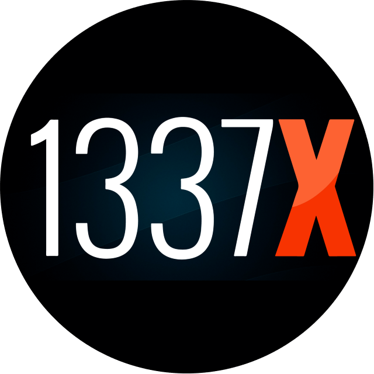 1337-logo-dark-circle-640.png</td><td valign="bottom">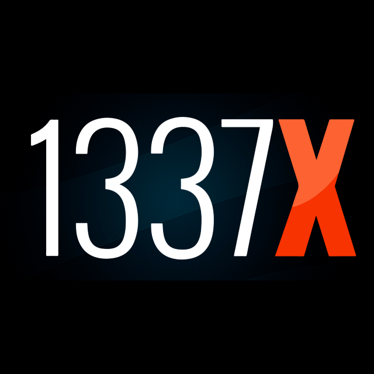 1337x-logo-dark-640.png</td></tr><tr><td valign="bottom"> 1337X-logo-dark.png</td><td valign="bottom"> 8-85386_lock-protect-guard-key-security-private-comments-key.jpg</td><td valign="bottom">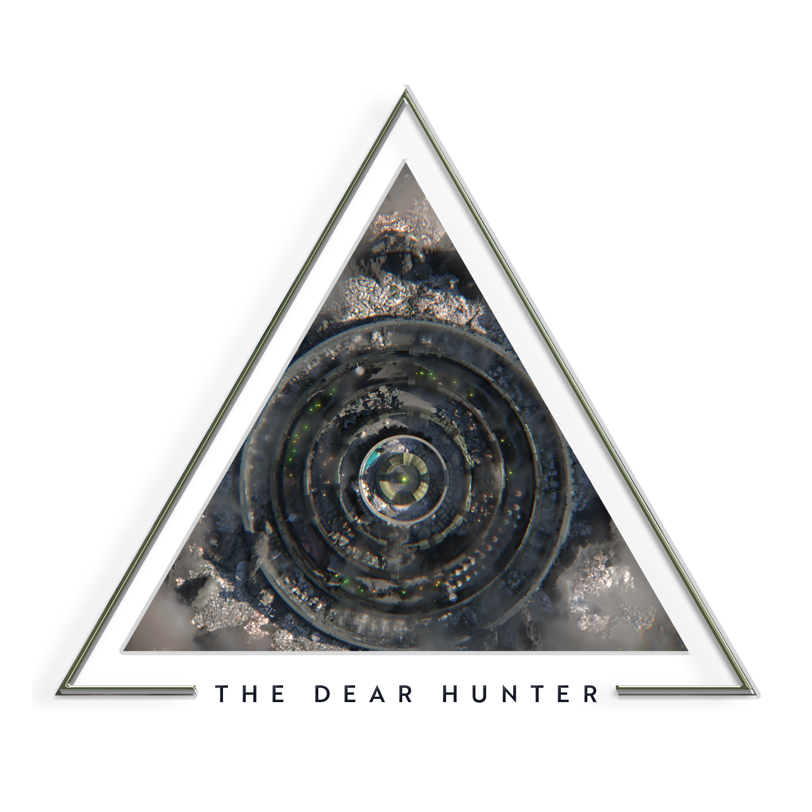 Antimai.png</td><td valign="bottom">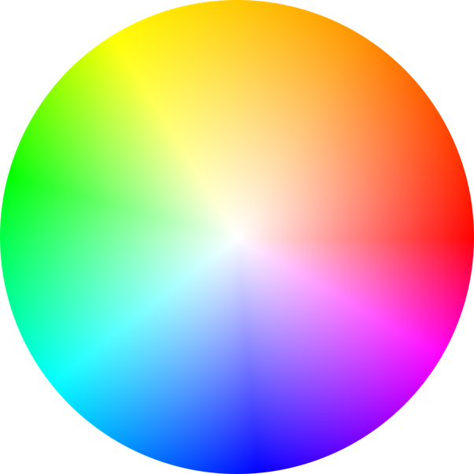 color-spectrum-icon-1.png</td></tr><tr><td valign="bottom"> computer-icons-font-awesome-multi-factor-authentication-school-computer-science-padlock.jpg</td><td valign="bottom"> dark-DuplicateDisplays-r.ico</td><td valign="bottom"> dark-DuplicateDisplays.ico</td><td valign="bottom"> dark-ExtendDisplays-r.ico</td></tr><tr><td valign="bottom"> dark-ExtendDisplays.ico</td><td valign="bottom"> dark-ExtendDisplaysRotateSecondary-r.ico</td><td valign="bottom"> dark-ExtendDisplaysRotateSecondary.ico</td><td valign="bottom"> dark-PrimaryDisplayOnly-r.ico</td></tr><tr><td valign="bottom"> dark-PrimaryDisplayOnly.ico</td><td valign="bottom"> dark-SecondaryDisplayOnly-r.ico</td><td valign="bottom"> dark-SecondaryDisplayOnly.ico</td><td valign="bottom"> discord-v2.png</td></tr><tr><td valign="bottom"> discord-v2.svg</td><td valign="bottom"> DisplayCAL-synthprofile.ico</td><td valign="bottom"> elementary-logo-16.png</td><td valign="bottom"> elementary-logo-24.png</td></tr><tr><td valign="bottom"> elementary-logo-32.png</td><td valign="bottom"> elementary-logo-64.png</td><td valign="bottom"> elementary-logo.png</td><td valign="bottom"> epic-logo-square.jpg</td></tr><tr><td valign="bottom"> Epic.png</td><td valign="bottom"> F1-logo-square.png</td><td valign="bottom"> file-spotify-logo-png-4.png</td><td valign="bottom"> Geek-Uninstaller-square.png</td></tr><tr><td valign="bottom">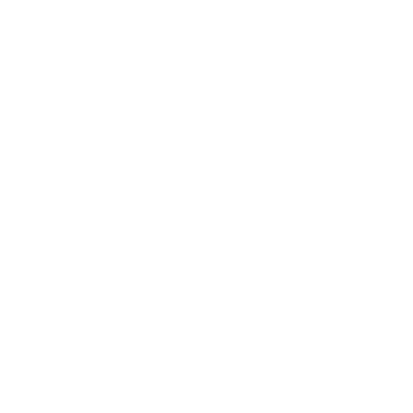 GitHub-512-ffffff.svg</td><td valign="bottom"> GitHub.png</td><td valign="bottom"> github.svg</td><td valign="bottom">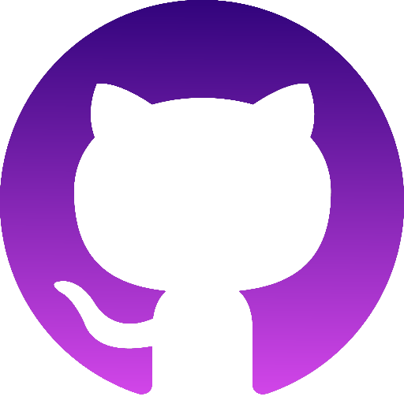 GitHubPurple.png</td></tr><tr><td valign="bottom">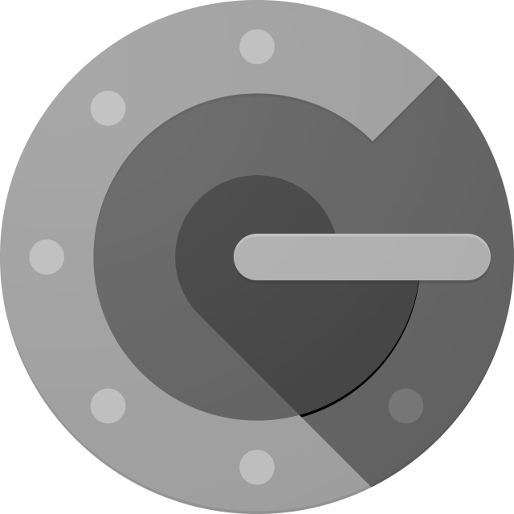 google-authenticator-2-small.png</td><td valign="bottom"> google-authenticator-2.png</td><td valign="bottom"> google-authenticator-2.svg</td><td valign="bottom"> google-authenticator-icon.png</td></tr><tr><td valign="bottom"> GSL logo black-gold.png</td><td valign="bottom">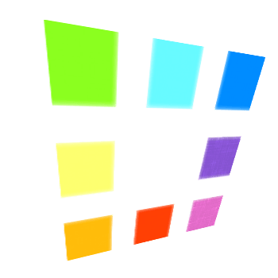 ICOconvert.png</td><td valign="bottom"> k6490pfrrr001.png</td><td valign="bottom"> kindpng_103199.ico</td></tr><tr><td valign="bottom"> lastfm-flat.png</td><td valign="bottom"> light-DuplicateDisplays-r.ico</td><td valign="bottom"> light-DuplicateDisplays.ico</td><td valign="bottom"> light-ExtendDisplays-r.ico</td></tr><tr><td valign="bottom"> light-ExtendDisplays.ico</td><td valign="bottom"> light-ExtendDisplaysRotateSecondary-r.ico</td><td valign="bottom"> light-ExtendDisplaysRotateSecondary.ico</td><td valign="bottom"> light-PrimaryDisplayOnly-r.ico</td></tr><tr><td valign="bottom"> light-PrimaryDisplayOnly.ico</td><td valign="bottom"> light-SecondaryDisplayOnly-r.ico</td><td valign="bottom"> light-SecondaryDisplayOnly.ico</td><td valign="bottom"> nomachine-square.png</td></tr><tr><td valign="bottom"> NYT-logo-square.png</td><td valign="bottom">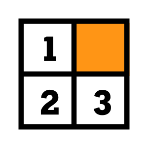 NYT-sudoku-card-icon.png</td><td valign="bottom">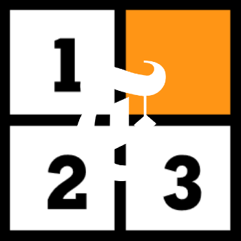 NYT-sudoku-logo-v1.png</td><td valign="bottom">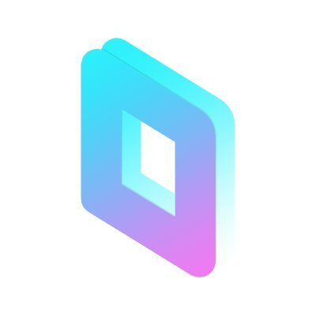 parsec-square-alt.jpg</td></tr><tr><td valign="bottom">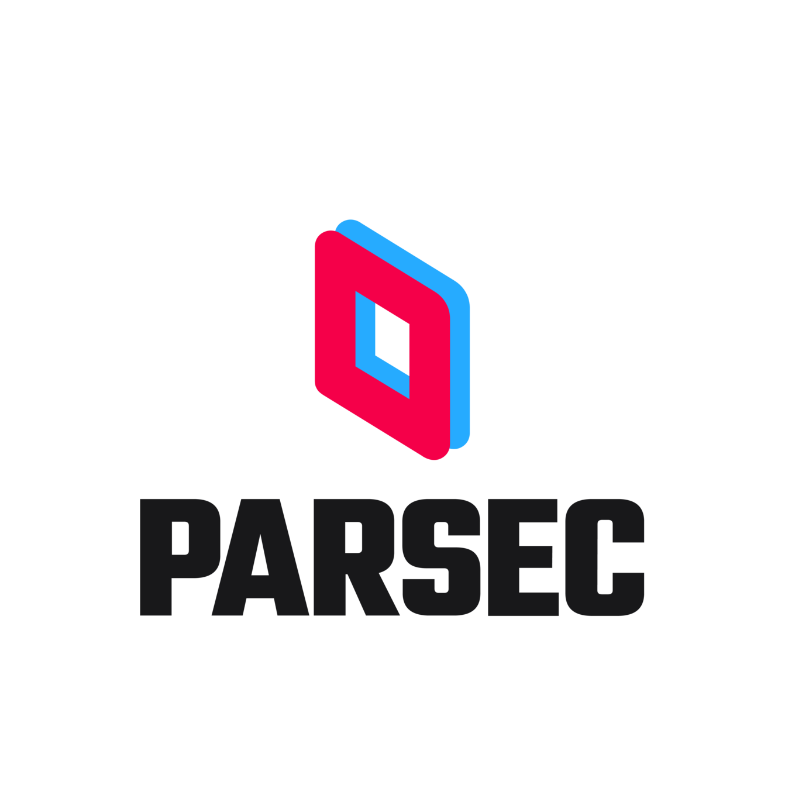 parsec-square-text.png</td><td valign="bottom"> parsec-square.png</td><td valign="bottom">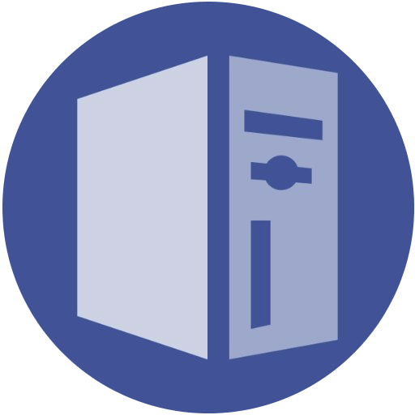 pcgamingwiki.png</td><td valign="bottom">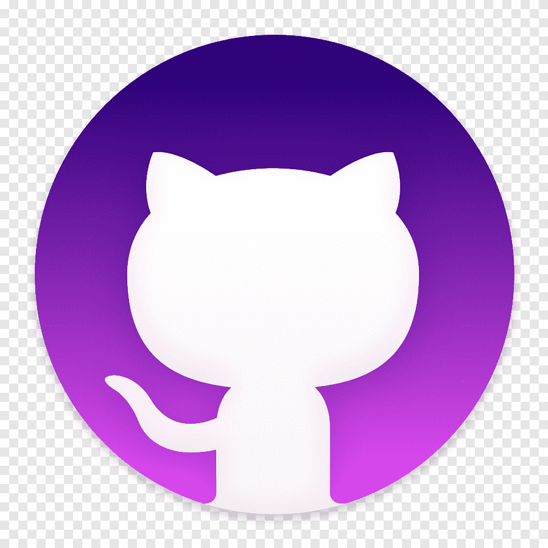 png-clipart-clay-os-6-a-macos-icon-github-desktop-white-cat-on-purple-background-icon.png</td></tr><tr><td valign="bottom"> pngtree-vector-lock-icon-png-image_318067.jpg</td><td valign="bottom"> PUqA0GH4ag0.jpg</td><td valign="bottom"> rainway-square.png</td><td valign="bottom"> rambox-current-logo-square.png</td></tr><tr><td valign="bottom"> rambox-logo-circle.png</td><td valign="bottom"> rambox-logo-circle.svg</td><td valign="bottom">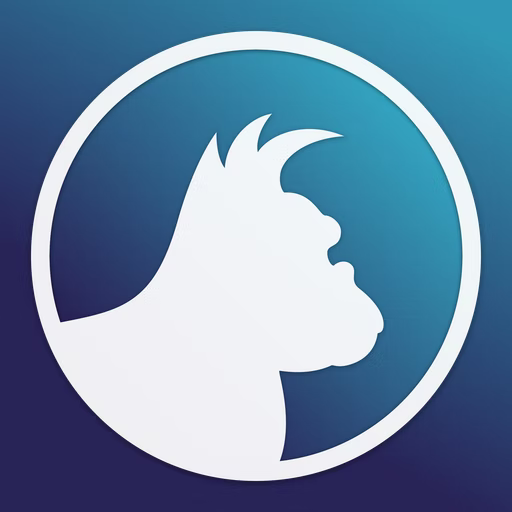 rambox-logo-sqaure.png</td><td valign="bottom"> rambox-logo.ico</td></tr><tr><td valign="bottom"> rambox-logo.png</td><td valign="bottom"> realstar-logo-new_qysnvp.png</td><td valign="bottom"> RegExr-x128.png</td><td valign="bottom"> RegExr.png</td></tr><tr><td valign="bottom"> ruTorrent-x128.png</td><td valign="bottom">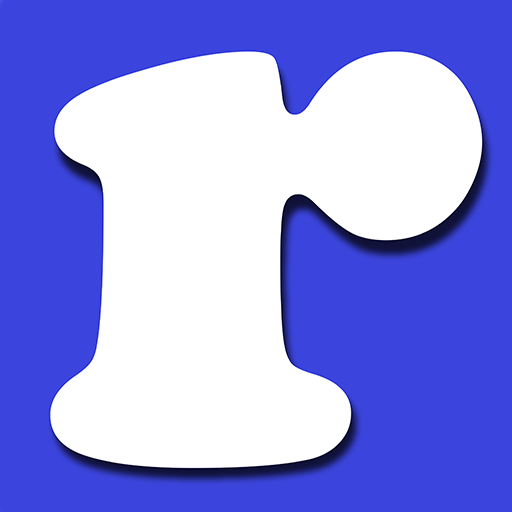 ruTorrent.png</td><td valign="bottom"> SABnzbd-square.png</td><td valign="bottom"> snapdrop.png</td></tr><tr><td valign="bottom">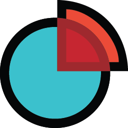 SpaceMonger_256.png</td><td valign="bottom"> spicetify.png</td><td valign="bottom"> spotify-dark.jpg</td><td valign="bottom"> spotify-square-white.png</td></tr><tr><td valign="bottom"> spotify.png</td><td valign="bottom"> Steam.ico</td><td valign="bottom"> steam_tile-small.png</td><td valign="bottom"> steam_tile.png</td></tr><tr><td valign="bottom"> streamable.png</td><td valign="bottom"> sudoku-card-icon.svg</td><td valign="bottom"> the-pirate-bay-logo-png-clip-art.png</td><td valign="bottom"> the-pirate-bay-logo.png</td></tr><tr><td valign="bottom"> vscode-dark.png</td><td valign="bottom">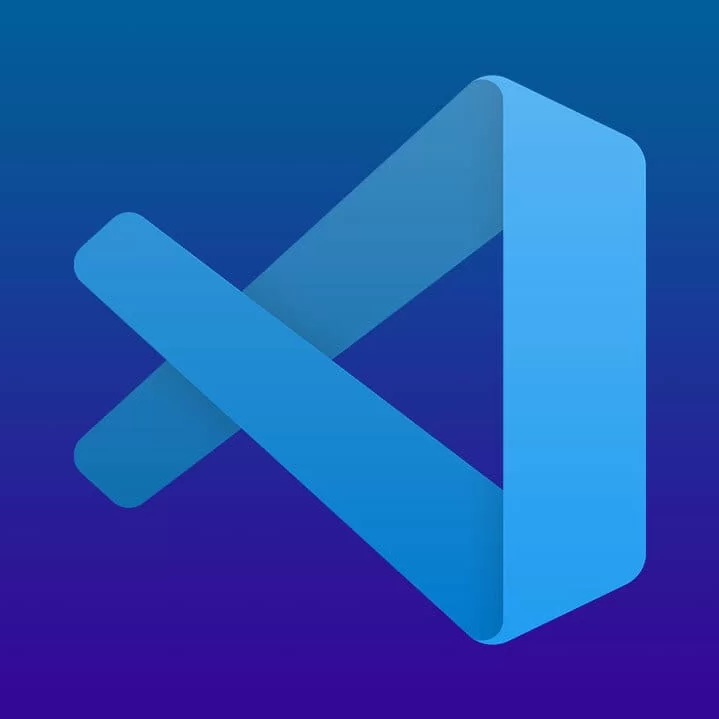 vscode-gradient.png</td><td valign="bottom"> vscode-square-big.png</td><td valign="bottom"> vscode-theme.svg</td></tr><tr><td valign="bottom">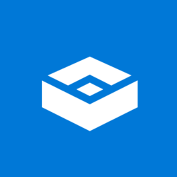 Windows-Sandbox-icon.png</td><td valign="bottom"> Windows_Terminal_logo-square-denoise.png</td><td valign="bottom">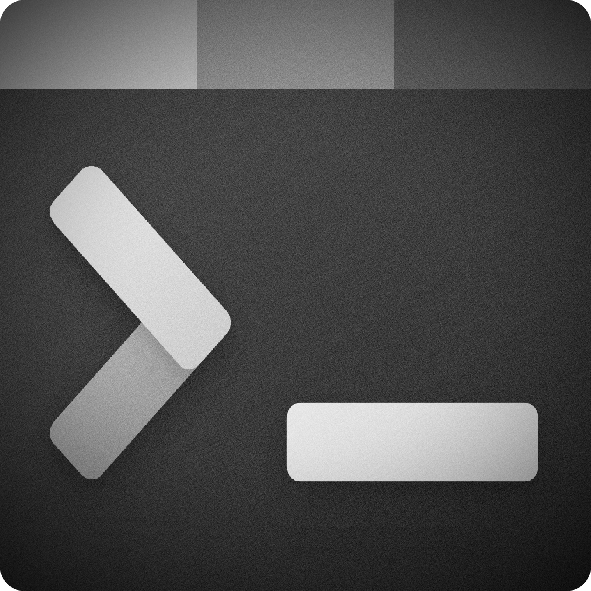 Windows_Terminal_logo-square-olay.png</td><td valign="bottom"> Windows_Terminal_logo-square.png</td></tr><tr><td valign="bottom"> Windows_Terminal_logo.svg.png</td><td valign="bottom"> windows_terminal_logo_svg_T3i_icon.ico</td><td valign="bottom"> x2convert.png</td><td valign="bottom"> Xyplorer-pro.png</td></tr><tr><td valign="bottom"> YouTube_circle-1200-ff2828.png</td><td valign="bottom">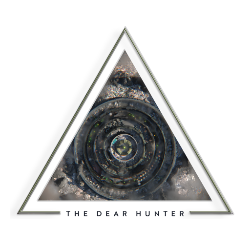 [x512]Antimai.png</td></tr></table>